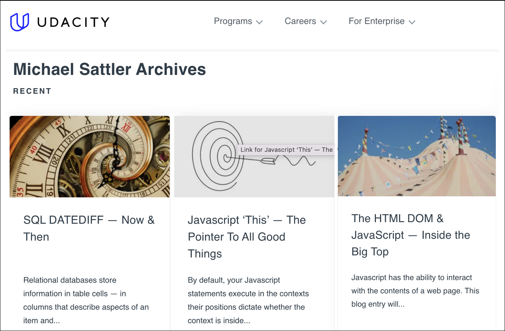

# Mickey Sattler — A Technical Writing Portfolio

**INTRODUCTION:** I'm a long-time software and quality assurance engineer who's had primary responsibility for producing technical documentation for my entire career. From API references, sample code and "Hello, World" demonstration apps, to white papers and online articles, the joy of explaning technical concepts and processes has been my priviledge.

**NON-DISCLOSURES AND ENCUMBERED WRITING:** Much of what I'm paid to write becomes proprietary information as soon as it leaves my hands (and is therefore unavailable for sharing externally). What follows are unencumbered exceptions, a real-world "portfolio" of sorts.

## Subject-matter expert, for Javascript & database programmers

For the learning company Udacity [I wrote several series](https://www.udacity.com/blog/author/michael-sattler) of posts as a subject-matter expert targeting novice programmers. Each has a different theme to make the dry technical reading a bit more engaging and accessible. 

<!-- 

 -->

One series was about databases and SQL:

* [An Introduction to SQL Case](https://www.udacity.com/blog/2021/02/an-introduction-to-sql-case.html)
* [SQL Tutorial — Database Programming](https://www.udacity.com/blog/2021/02/sql-tutorial-database-programming.html)
* [SQL Join – An Introduction](https://www.udacity.com/blog/2021/01/an-introduction-to-sql-join.html)
* [SQL Update – An Introduction](https://www.udacity.com/blog/2021/01/an-introduction-to-sql-update.html)

Javascript and releated topics:

* [Javascript HTML Form Validation — Dotting Every 'i'](https://www.udacity.com/blog/2021/10/javascript-html-form-validation-dotting-every-i.html)
* [The HTML DOM & JavaScript — Inside the Big Top](https://www.udacity.com/blog/2021/09/the-html-dom-javascript-inside-the-big-top.html)
* [Javascript JSON & JSON Objects — Moving Data Around](https://www.udacity.com/blog/2021/08/javascript-json-json-objects-moving-data-around.html)
* [Javascript Events — Handling All The Things](https://www.udacity.com/blog/2021/08/javascript-events-handling-all-the-things.html)

## Documenting novel, self-modifying data charting for a pipeline

To graphically illustrate battery performance on custom Android biometric security devices (the code follows) I coded and documented a novel, self-modifying technique of charting data as part of a round-the-clock pipeline.

* *[gnuplot ~ a non-trivial introduction](https://github.com/mickeys/non_trivial_gnuplot/blob/master/a_real_world_gnuplot_introduction/README.md)* illustrates self-modifying GNU Plot code to process the battery telementry data.

## Developing on-board telemetry & internal documentation

While working as lead quality assurance engineer on custom Android biometric authentication portable hardware, we were faced with reports of vexing remote battery issue with some African customers.

Distance and urgency spurred me to write on-board telemetry within the constraints of the older operating system, how to remotely capture this time-based ephemeral information, how to combine all these data sets without worry of loss from collision, how to programmatically process and trim the data, and lastly, how to automatically create informative charts. 

The first entry here is my write-up on how I wrote self-modifying GNU Plot code to meet my needs. The following two are examples of how I write and document code.

* [battstat.sh](https://github.com/mickeys/my_android_utilities/blob/master/battstat.sh?ts=4) is the deployed code (and in-line documentation).
* [speed.sh](https://github.com/mickeys/my_android_utilities/blob/master/speed.sh?ts=4) is related code I developed and documented, comparing the permutations of data transfer speed between these Android devices, SD cards, and eMMC. This code included an extensible system of adding new tests and the creation of a non-compressible video as a transfer source.

## Troubleshooting networking behind the Great Firewall of China

While traveling around China — working with the semiconductor fabrication houses for our custom Android devices — I encountered many network issues. Some were because of physical network installation or deployment topology, others due to immature software development making inappropriate assumptions about networking and yet others were caused by the Great Firewall of China.

* [pinger.sh](https://github.com/mickeys/non_trivial_gnuplot/blob/master/graphing_ping/pinger.sh?ts=4) is the network testing and data capture code I used to  present live, actionable data to hotel IT teams.
* *[Triaging networking issues in real-time](https://github.com/mickeys/non_trivial_gnuplot/blob/master/graphing_ping/README.md)* is the technical write-up I did to explain to other travelers how to debug similar issues.

## Documenting coding and tools

Much of the work of a technical writer coming from a software engineering background is identifying workflow issues, writing code to automatically solve the problem, and then document the code and thought process into a user's guide.

* *[Making a movie from a webcam capture](https://github.com/mickeys/video_from_webcam_stills)* — how to deploy off-the-shelf UNIX utilities across multiple machines to capture ephemeral webcam images and stitch them into a movie.
* *[ffmpeg – split and cut video segments](https://sattlers.org/2019/09/30/ffmpeg-split-and-cut-video-segments/)* — how to use a UNIX command-line tool to perform video cuts and splits within a pipeline.
* *[A Github repository update-checker](https://github.com/mickeys/how_to_tips_and_tricks/tree/master/github/github_update_checker)* — how to programattically check whether a repository has been updated, how to capture information about the changes, for use in connecting to other API-driven tools, such as JIRA. I used this to build a dynamic end-to-end quality assurance yoke, which took updated test definitions from one git file, ran the tests, and used the results to populate email and JIRA tickets to drive the next day's work.

## Modern documentation tools in a dynamic git-driven pipeline — a manifesto

After confronting "challenging" requests from a client using antiquated word-processing technology and a manual workflow, I quickly penned the 5-part *[Why Everything You’re Doing In Technical Writing Is (Probably) Wrong](https://sattlers.org/2021/07/02/writing-about-writing-technical-documentation/)*, championing code-centric documentation generated from git repositories within a CI/CD pipeline targeting the managers involved in budget allocation for future development and documentation work.

## My book, Internet TV with CU-SeeMe

From 1995, my book *[Internet TV with CU-SeeMe](https://sattlers.org/mickey/CU-SeeMe/internetTVwithCUSeeMe/index.html)* (ISBN 1-57521-006-1) (available on [Amazon](https://www.amazon.com/Internet-TV-Cu-Seeme-Michael-Sattler/dp/1575210061)), as it went to the publisher. The web content is a bit dated (as it appeared in 1995), not reformatted for mobile devices, and I have to disclaim the quality of the images, but there it is :-)

## Miscellany

* [children.sh](https://github.com/mickeys/github-markdown-child-pages) — a way of creating a graphical relative representation of the child files and subfolders in git repository-based documentation, providing hyperlinks to a configurable set of documents. By default, only Markdown documents which are being tracked by git are shown, with the Markdown document title as the hyperlink text. (See this in the unrelated *[How-to tips and tricks](https://github.com/mickeys/how_to_tips_and_tricks)* document.)
* *[Nightwatch.js — A Test Setup Tutorial](https://github.com/mickeys/nightwatch_js_test_setup_tutorial)* was the first stages of internal onramping instructions for junior quality assurance developers.
* *[How I Lost 60 Pounds On Keto](https://github.com/mickeys/lose-weight-keto)* — a step-by-step action-oriented `tl;dr` guide without all the customary fluff.
* [DIY Best Cat / Dog Harness & Leash!](https://sattlers.org/2021/06/07/diy-best-cat-dog-harness-leash/) — context around and instructions for building a choke-proof self-adjusting paracord pet harness I designed for my cat, Thor.
* [Michael Sattler: The Tech-Nomad's Cafe Office](https://sattlers.org/mickey/culture/comp/technomad/eciffo/) was a 1996 article in the Japanese magazine *ECIFFO* about my pre-WiFi remote working setup (using Ricochet radio-modems).